# Architecture Overview

## System Architecture

The Oracle Doc Generator follows a clean architecture pattern with clear separation of concerns across three main layers: **Extraction**, **Processing**, and **Generation**.

```mermaid
graph TB
    subgraph Input["🔌 Input Layer"]
        Config["config.py<br/>Database Credentials"]
        Main["main.py<br/>Entry Point"]
    end
    
    subgraph Oracle["🗄️ Oracle Database"]
        Dict["User Dictionary Views<br/>(USER_*)"]
    end
    
    subgraph Extractor["📥 Extractor Layer"]
        Tables["tables.py"]
        Views["views.py"]
        Sequences["sequences.py"]
        Procedures["procedures.py"]
        Functions["functions.py"]
        Packages["packages.py"]
        Triggers["triggers.py"]
        Types["types.py"]
        Indexes["indexes.py"]
        Synonyms["synonyms.py"]
        Jobs["jobs.py"]
        Dependencies["dependencies.py"]
    end
    
    subgraph RawData["📊 Raw Data"]
        RawObjects["Extracted Objects<br/>Tables, Views, Procedures<br/>Functions, Packages, etc."]
    end
    
    subgraph Processor["⚙️ Processor Layer"]
        Relations["relations.py<br/>FK/PK Analysis"]
        DepsGraph["deps_graph.py<br/>Dependency Graph"]
        SchemaMap["schema_map.py<br/>Object Mapping"]
    end
    
    subgraph ProcessedData["🔗 Processed Data"]
        ProcessedObjects["Mapped Objects<br/>Relationships<br/>Dependencies<br/>Schema Map"]
    end
    
    subgraph Generator["📤 Generator Layer"]
        HtmlGen["HTML Generator"]
        PlantUML["PlantUML Diagrams"]
        Templates["HTML Templates"]
        Assets["CSS & JavaScript"]
    end
    
    subgraph Output["📄 Output"]
        IndexHTML["index.html"]
        TablesHTML["Tables Pages"]
        ViewsHTML["Views Pages"]
        ProcsHTML["Procedures Pages"]
        FuncsHTML["Functions Pages"]
        PackagesHTML["Packages Pages"]
        OtherHTML["Other Object Pages"]
        SearchJS["search.js<br/>Real-time Search"]
        StyleCSS["style.css<br/>Styling"]
    end
    
    Config -->|Database Connection| Main
    Main -->|Execute| Extractor
    Extractor -->|Query| Oracle
    Oracle --> Dict
    Dict -->|Data| Extractor
    Extractor -->|Emit| RawData
    RawData -->|Feed| Processor
    Processor -->|Analyze & Map| ProcessedData
    ProcessedData -->|Pass to| Generator
    Generator -->|Render Templates| HtmlGen
    Generator -->|Encode Diagrams| PlantUML
    Templates -->|Used by| HtmlGen
    Assets -->|Link in| HtmlGen
    HtmlGen -->|Generate| Output
    PlantUML -->|Generate| Output
    SearchJS -->|Enable| IndexHTML
    
    style Input fill:#e1f5ff
    style Oracle fill:#fff3e0
    style Extractor fill:#f3e5f5
    style RawData fill:#fce4ec
    style Processor fill:#e8f5e9
    style ProcessedData fill:#f1f8e9
    style Generator fill:#fef5e7
    style Output fill:#e0f2f1
```



## Layer Responsibilities

### 1. **Extractor Layer** (`extractor/`)
Handles direct database communication via Oracle's USER_* dictionary views.

- **Domain Objects**: Tables, Views, Sequences, Procedures, Functions, Packages, Triggers, Types, Indexes, Synonyms, Jobs, Dependencies
- **Responsibility**: Query Oracle database and extract raw metadata
- **Key Principle**: SQL queries only—no awareness of HTML or output formats

### 2. **Processor Layer** (`processor/`)
Transforms raw data into meaningful relationships and dependencies.

- **relations.py**: Analyzes foreign key and primary key relationships
- **deps_graph.py**: Builds dependency graph between database objects
- **schema_map.py**: Creates a comprehensive schema object map
- **Responsibility**: Data enrichment and relationship mapping
- **Key Principle**: No database queries—processes only extracted data

### 3. **Generator Layer** (`generator/`)
Produces final HTML documentation from processed data.

- **HTML Builder**: Converts objects to HTML pages
- **PlantUML Diagrams**: Generates relationship diagrams with zlib compression
- **Templates**: Base HTML structure (reusable across all pages)
- **Assets**: CSS styling and JavaScript search functionality
- **Responsibility**: Output generation in multiple formats
- **Key Principle**: No database queries—reads processed data only

## Data Flow

```
User Input (config.py)
        ↓
    main.py
        ↓
    Extractor ←→ Oracle Database
        ↓
    Raw Data (dictionaries/objects)
        ↓
    Processor (enrich & map)
        ↓
    Processed Data (relationships, dependencies)
        ↓
    Generator (render & output)
        ↓
    HTML Files + Assets + Diagrams (output/)
```

## Key Features by Layer

### Extractor Features
- Comprehensive database metadata extraction
- Support for 12+ object types
- Accurate object counting and status tracking
- Dependency tracking via dictionary views

### Processor Features
- Foreign key relationship mapping
- Dependency graph construction
- Cross-object reference resolution
- Schema-wide relationship analysis

### Generator Features
- Dynamic HTML page generation
- Real-time JavaScript search
- Automatic PlantUML diagram encoding
- Template-based rendering
- Intelligent object linking

## Configuration & Execution

```
┌─────────────────────────────────────┐
│  Configuration (config.py)          │
│  - Host, Port, Service              │
│  - User, Password, Schema           │
└────────┬────────────────────────────┘
         │
         ↓
┌─────────────────────────────────────┐
│  main.py (Entry Point)              │
│  - Menu: Generate Documentation     │
│  - Orchestrate extraction           │
└────────┬────────────────────────────┘
         │
         ↓
┌─────────────────────────────────────┐
│  Complete Documentation in output/  │
│  - HTML files (all object types)    │
│  - Searchable interface             │
│  - Relationship diagrams            │
│  - Source code references           │
└─────────────────────────────────────┘
```

## Dependencies

- **oracledb**: Oracle database connectivity
- **openpyxl**: (Available for future exports)
- **zlib**: Diagram compression (stdlib)
- **base64**: Diagram encoding (stdlib)

## Security

- Credentials stored in `config.py` (git-ignored)
- No sensitive data in version control
- Generated output files in `output/` (also git-ignored)
- Read-only schema access via USER_* views

---

*For detailed implementation information, see the README.md in the repository root.*
